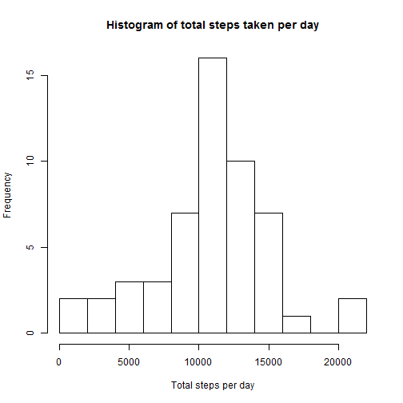
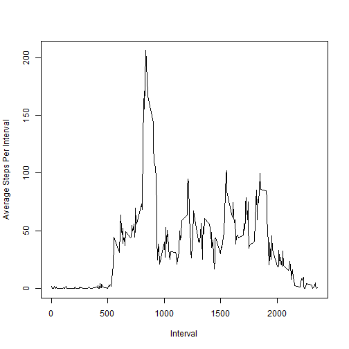
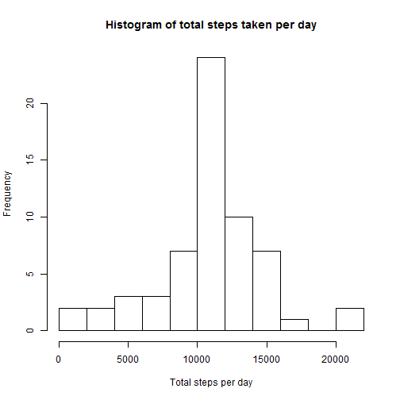
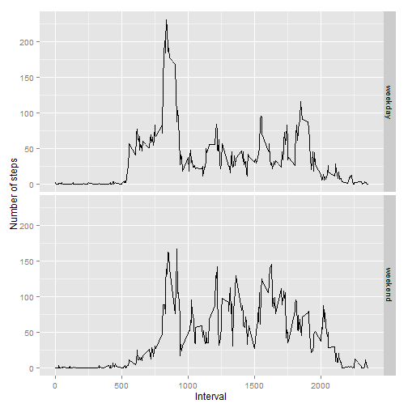

## Loading and preprocessing the data

```r
csv <- read.csv("activity.csv", na.strings="NA")
csv$date <- as.POSIXct(csv$date)
completeRows <- csv[complete.cases(csv),]
```
  
  
  
## What is mean total number of steps taken per day?
###Total number of steps taken per day:  

```r
totalStepsPerDay <- aggregate(completeRows$steps, by=list(completeRows$date), FUN=sum)
hist(totalStepsPerDay$x, breaks=10, main="Histogram of total steps taken per day", xlab="Total steps per day")
```

 
  
###Mean of the total steps per day:

```r
mean(totalStepsPerDay$x)
```

```
## [1] 10766.19
```
###Median of the total steps per day:

```r
median(totalStepsPerDay$x)
```

```
## [1] 10765
```
  
  
  
## What is the average daily activity pattern?
### Time series plot of average steps per interval

```r
avgStepsPerInterval <- aggregate(completeRows$steps, by=list(completeRows$interval), FUN=mean)
with (avgStepsPerInterval,
      plot(x ~ Group.1, type="l", ylab="Average Steps Per Interval", xlab="Interval"))
```

 
  
### 5-minute interval with maximum average number of steps

```r
avgStepsPerInterval[which.max(avgStepsPerInterval$x), ]$Group.1
```

```
## [1] 835
```
  
  
  
## Imputing missing values
### Number of missing rows

```r
sum(!complete.cases(csv))
```

```
## [1] 2304
```
  
  
  
## New data with filled in information

The strategy used was to calculate the average steps per interval across all the days and, when missing data(steps==NA) is encountered, use the average steps per interval to replace the NA value.

###Total number of steps taken per day:  

```r
# merge average counts with original data to allow for using the interval average as a replacement for NA values
mergedCsv <- merge(csv, avgStepsPerInterval, by.x = "interval", by.y = "Group.1", sort = FALSE)

# find any "steps" that are NA and replace them with the average for that interval
mergedCsv <- transform(mergedCsv, steps = ifelse(is.na(steps), x, steps))

totalStepsPerDayNew <- aggregate(mergedCsv$steps, by=list(mergedCsv$date), FUN=sum)
hist(totalStepsPerDayNew$x, breaks=10, main="Histogram of total steps taken per day", xlab="Total steps per day")
```

 
  
###Mean of the total steps per day:

```r
mean(totalStepsPerDayNew$x)
```

```
## [1] 10766.19
```
###Median of the total steps per day:

```r
median(totalStepsPerDayNew$x)
```

```
## [1] 10766.19
```
  
Since the NA rows were originally excluded, and with this strategy, the values are to be replaced with the average, there should be no impact on the *mean* of the steps. However, since the averages that were inserted may not necessarily be an actual existing value from the original data, the *median* has the opportunity to change. Indeed, it can be seen in the data that a value assumed from the average was chosen as the new median.
  
Besides that minor change, the histogram will also show higher frequencies across the board, simply because there is now more data provided.
  
  
  
## Are there differences in activity patterns between weekdays and weekends?

```r
library(ggplot2)
dowCsv <- transform(mergedCsv, dayofweek = ifelse(weekdays(date) == 'Saturday' | weekdays(date) == 'Sunday', 'weekend', 'weekday'))
avgDowCsv <- aggregate(dowCsv$steps, by=list(dowCsv$interval, dowCsv$dayofweek), FUN=mean)
qplot(Group.1, x, facets=Group.2~., data=avgDowCsv, geom=c("path"), xlab="Interval", ylab="Number of steps")
```

 
